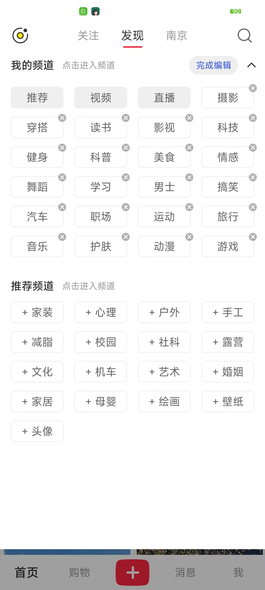
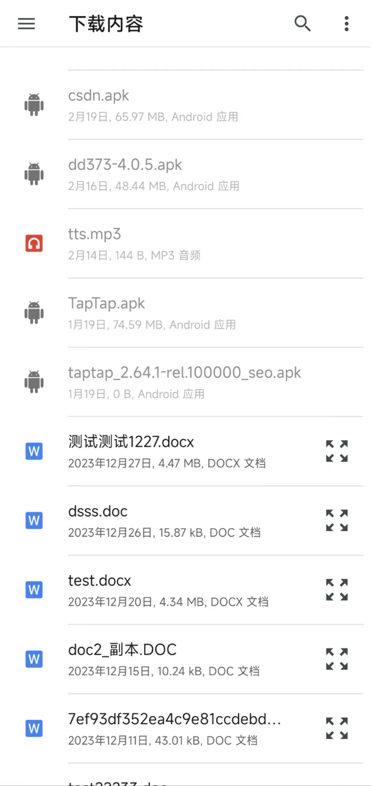

# 简介

模拟小红书前端项目
前端： ReactNative + Mobx + TS
服务端： eggjs

## 练习

- 熟悉使用ts，开发组件
- 使用mobx进行状态管理
- 动画组件、拖拽

## 原生练习

- android：分片下载、文件选择器、文件预览
- ios：文件选择器、quicklook文件预览

### 模拟项目支持功能

- 频道编辑(频道分类、编辑个人喜欢频道)
- 内容详情(点赞、收藏、评论)
- 消息通知(页面展示)
- 个人页面(笔记、收藏、赞过)

### 截图

- 首页&频道

- 帖子

- 商品

- 消息

- 个人

## 部分原生组件

- android文件选择(文件预览：缓存到临时文件，分享到第三方应用进行查看)

- ios文件选择以及quicklook预览

